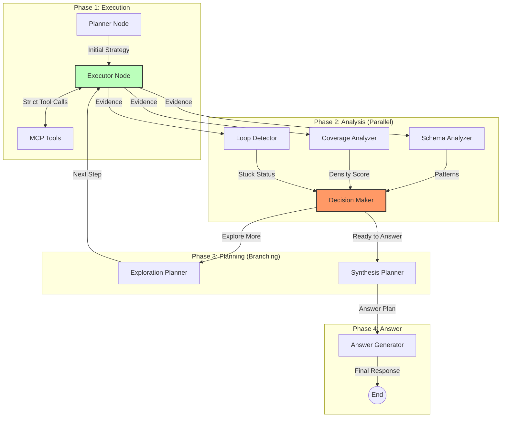
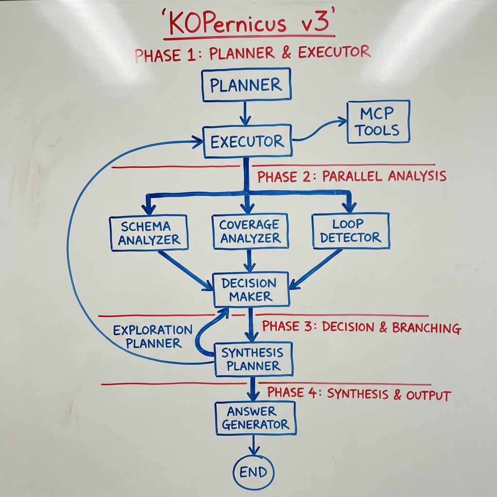
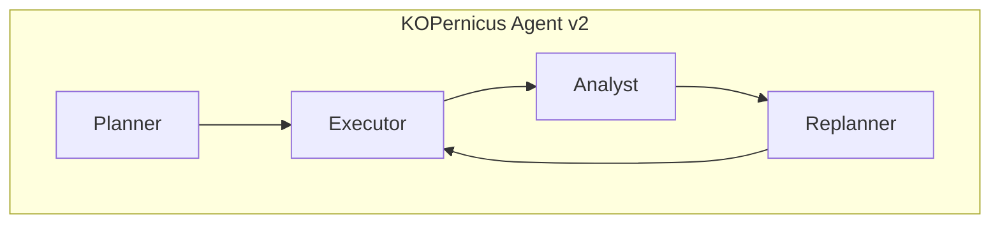
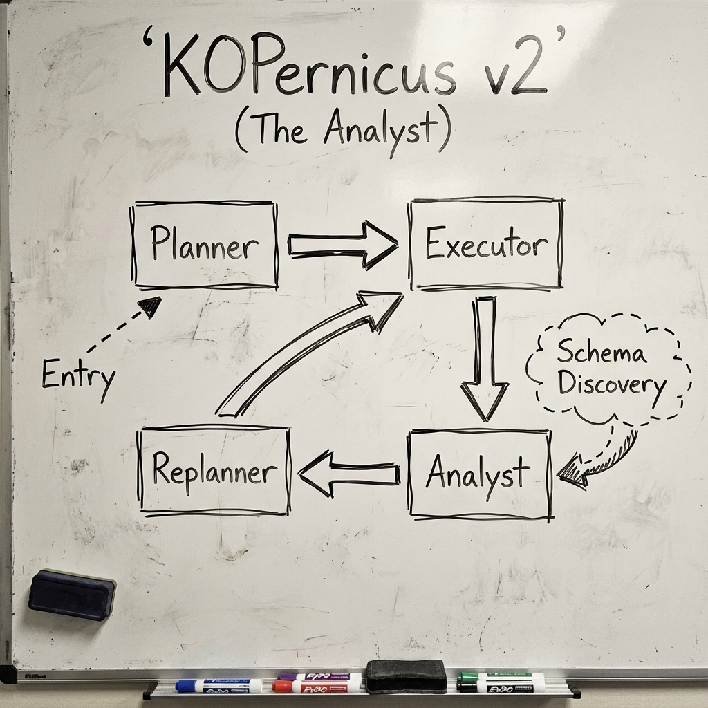
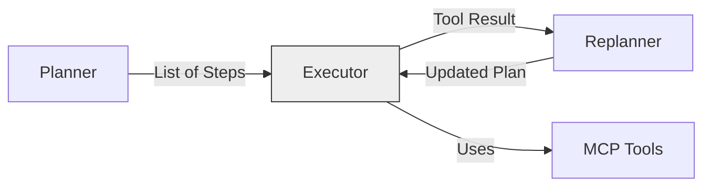
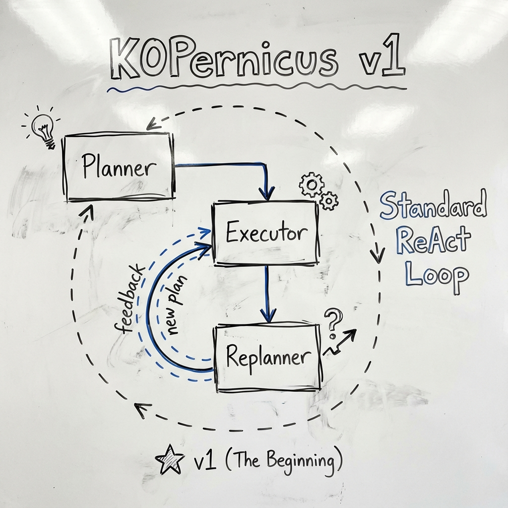

# KOPernicus Architecture Diagram

## v3: The KOPernicus System (Decomposed)
**"The Specialist Team"**

This diagram represents the **v3 (Decomposed)** architecture implemented in this current code base. It is designed for granular control, with separated concerns for analysis, decision making, and planning.

### Mermaid Diagram

### Description
- **Phase 1: Execution**: 
  - **Planner**: Sets the initial direction.
  - **Executor**: strictly handles tool interaction.
- **Phase 2: Analysis**:
  - Three specialized analyzers run in parallel (logically) to assess the state without making decisions.
  - **Decision Maker**: Aggregates all signals to make a single state transition decision.
- **Phase 3: Planning**:
  - **Exploration Helper**: Plans the next logical step if more info is needed.
  - **Synthesis Helper**: Structures the final answer if sufficient info is gathered.
- **Phase 4: Answer**:
  - **Answer Generator**: Writes the final response with strict citation rules, separate from logic.

### KOPernicus Visualization (v3 Conceptual)

---

## v2: The Thinker (Plan-Reason-Act)
**"The Analyst"**

To solve the "mindless execution" problem of v1, we introduced the **Analyst** node. This shifted the paradigm from "doing" to "reasoning".

### Mermaid Diagram

### Visualization

---

## v1: The Foundation (Standard ReAct)
**"The Doer"**

The initial version was a standard implementation of the Plan-and-Execute pattern using a ReAct agent.

### Mermaid Diagram

### Visualization

