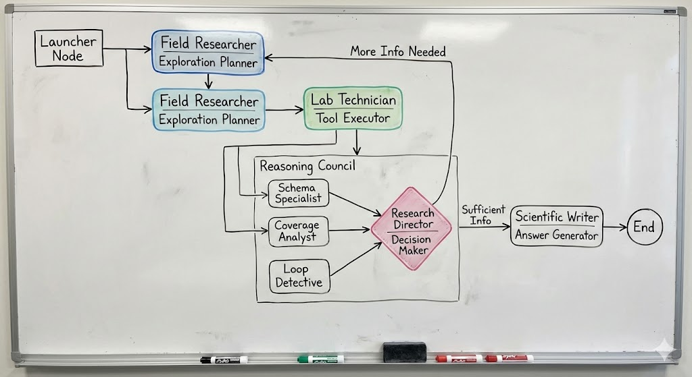

# KOPernicus Architecture / Evolution

## v4: The KOPernicus Community 

** Same guy different Jacket ** 


I was looking at the prompts of each node , in v3 and i said  "Hey, what's going on? 🎶". So what i noticed was rather simple , in the prompts every node was given "You are a <some role definition> here's some data , do something". This format of the prompt gives isolation to each node, and doesn't have sense of common goal across the nodes. So maybe the harmony problem might be solved by making the nodes realize that they are part of a community. 


```I was reviewing the prompts and all of the prompts seems to give the LLMs characters such as answer prompt starts with "You are the answer writer" ... or for synthesis planner "You are the answer architect" ... just looking at all of this i think they miss out on what kind of community they belong in or the bigger contect why this task is assigned to them does that make sense? ``` 
Posed that question to both gemini and chat-gpt, chatgpt came up with a reasearch community analogy and gemini pointed out somthing similar to that. So yeah , v4 is a step in that direction. 

Ok some notes here, my context managment is not the best ... 
- Resolves curie ... forgets about it and trys to reslove again .... 
- Loops over and over again with the same loop patterns. 
- Descision node is a bit stringent , even after adding some instructions around considering biological effects and giving it a bit more hints around rewarding novelity it seems to be a bit too strict. For eg it would more than often go from disease -> gene-> chemical .... even if there were gene -> gene that could potentially have biological relevance.
- This behaviour in the Descision node influnces the exploration node (which comes up with the next set of tasks for the executor)... to go and do the same thing over and over again. 
- I think we need a new node that will summarize critical steps .... and then let that be the overall history of what has occurred. I have to remind myself that every node call is stateless , execept for the context its given. This is why context engineering is so important... 

## v3: The KOPernicus System (Decomposed)

### KOPernicus Visualization (v3 Conceptual)



This diagram represents the **v3 (Decomposed)** architecture implemented in this current code base. It is designed for granular control, with separated concerns for analysis, decision making, and planning.

### Description
- **Phase 1: Execution**: 
  - **Planner**: Sets the initial direction.
  - **Executor**: strictly handles tool interaction.
- **Phase 2: Analysis**:
  - Three specialized analyzers run in parallel (logically) to assess the state without making decisions.
  - **Decision Maker**: Aggregates all signals to make a single state transition decision.
- **Phase 3: Planning**:
  - **Exploration Helper**: Plans the next logical step if more info is needed.
  - **Synthesis Helper**: Structures the final answer if sufficient info is gathered.
- **Phase 4: Answer**:
  - **Answer Generator**: Writes the final response with strict citation rules, separate from logic.

This one is a bit more complex than v2, but i think it makes more sense. The nodes are seperated to do specific things. And we do a lot of state (Memory) sharing between each node. This can be a little hard to co-ordinate. And nodes need to be in harmony to the common goal. There is some refinement to be done. I would say for one hop queries it does more than just guess and answer as seen in the [examples](README.md#examples).
This is some nice progress, but co-odination is still a problem . There are some underlying issues with how to better shift strategy when looping becomes intense (some loops are easier to detect than others, i have seen loops of 4 or 5 steps, rather than a single step back and forth). So The might be a need for a step to re-align "every-one" , "every expert" in one common goal , every now and then. 

---

## v2: The Thinker (Plan-Reason-Act)

### Visualization


To solve the "mindless execution" problem of v1, we introduced the **Analyst** node. This shifted the paradigm from "doing" to "reasoning". This node will look at the current plan that was recommended by the replanner, it will consider the user query and also response of the executor to make a "Recommendation" on what to do next. The final strategy will still be made by the replanner. But the analyst step will provide a pause and think moment so the next steps in the plan are more thought out and less likely to go off rails. But then the issue here as big context, and the nodes were trying to do too much with a single prompt. So for v3 we separated the concerns into different nodes. It made a little bit more sense to me, but i still have a feeling that it can be done better.

The important behaviour change in this version is that the analyst will make sure the planner remembers and considers results of previous steps. This memory of what's been done is crutial in keeping the big picture in mind and still thinking about the immidate next steps.


---

## v1: The Foundation (Standard ReAct)

### Visualization


The initial version was a standard implementation of the Plan-and-Execute pattern using a ReAct agent.
This is a good starting point, but it has limitations in terms of reasoning and decision making. The main thing that i noticed with this was that it was going off rails often. By this i mean , it would slowly drift away from the user query and start doing things that were not relevant to the task. So we introduced the Analyst node to help it reason about the task and make decisions [v2](#v2-the-thinker-plan-reason-act). 
